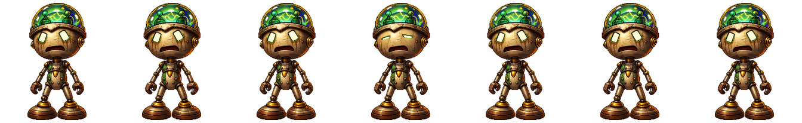

# Claude Code Pet

An always-on-top animated desktop pet for the **Claude Code CLI** — and a `hatch-pet`
skill that lets you create your own, the way Codex lets you hatch one for ChatGPT.

Codex has pets. Claude Code does not. This adds them, and goes a little further: the pet
relays what Claude is actually doing, counts your parallel sessions, and lets you click
through to any of them.



## What it does

- **Relays the work.** A task card under the pet shows the prompt as a title and the tool
  call in flight as a subtitle — "Editing `pet_overlay.py`", "Running the test suite",
  "Done".
- **Reacts.** `think` while Claude works, `shrug` when it wants permission, `celebrate`
  when a turn finishes, `angry` on error.
- **Counts parallel sessions.** Hover it for a badge with the number of live Claude
  sessions; click that to list them all, and click a row to jump to that session.
- **Is a pet.** Drag it and it walks. Hover it and it hops, then waves. Scroll to resize.
  `pet` toggles it.

## Install

```bash
git clone https://github.com/KonradTT/claude-code-pet.git
cd claude-code-pet
./install.sh
```

Then restart Claude Code so it picks up the hooks. `./uninstall.sh` reverses all of it.

The installer creates a venv, installs the reference pet, installs the `hatch-pet` skill
and the `pet` command, registers a login agent so the overlay is always running, and merges
lifecycle hooks into `~/.claude/settings.json`. That merge **backs the file up first, only
ever touches its own entries, and refuses to run if your settings are not already valid
JSON** — your existing hooks are left alone.

- `./install.sh --no-hooks` — don't touch `settings.json` (the pet then can't see Claude's activity)
- `./install.sh --no-agent` — no autostart; run `engine/pet_overlay.py` yourself

**macOS only** for now. It leans on `launchd`, and on a Qt attribute that only exists on
macOS. Nothing is Apple-specific in principle — the window handling would need a port.

## Hatching your own pet

Ask Claude: *"hatch me a pet"*. The `hatch-pet` skill will design a character — from your
description, or from what it already knows about your interests — and hand you an exact
spritesheet brief.

**Claude Code cannot generate images**, so the artwork itself comes from an image
generator (Codex, ChatGPT, anything). Everything either side is automated: the brief, grid
detection, slicing, validation, install, activation.

```bash
PY=.venv/bin/python
$PY engine/hatch.py prompt --id owl --name "Otto" --desc "A brass owl with a monocle"
$PY engine/hatch.py import ~/Downloads/otto.png --id owl --name "Otto"
$PY engine/hatch.py check owl        # baseline, transparency, empty frames
pet use owl
```

Already have a Codex pet? Import it directly — that is exactly how the bundled one was made:

```bash
$PY engine/hatch.py codex copper-dome-bot --id mumu --name "Mumu"
```

### The sheet

One animation per row, frames left-packed, uniform cells, transparent gutters. The grid is
detected automatically (`--cols`/`--rows` to override).

| # | Animation | Plays when | Loops |
| --- | --- | --- | --- |
| 0 | `idle` | nothing is happening | yes |
| 1 | `walk_right` | dragged right | yes |
| 2 | `walk_left` | dragged left | yes |
| 3 | `wave` | your cursor is on it | yes |
| 4 | `jump` | the moment you hover | once |
| 5 | `celebrate` | a turn finished | once |
| 6 | `shrug` | Claude needs permission | yes |
| 7 | `think` | Claude is working | yes |
| 8 | `angry` | something went wrong | yes |
| 9 | `turn_out` | it is being hidden | once |
| 10 | `turn_in` | it is being shown | once |

The single most important property is that **every frame's feet sit on the same baseline**.
If they wander, the pet bobs while standing — this is the most common flaw in generated
sheets, and `hatch.py check` measures it.

## Commands

| What | Command |
| --- | --- |
| Toggle | `pet` (or `/pet` inside Claude Code) |
| Force on / off | `pet on` · `pet off` |
| Follow sessions | `pet auto` |
| Resize | `pet size 180`, or scroll over it |
| Find it | `pet screens`, then `pet center 0` |
| Perform | `pet wave` · `pet jump` · `pet celebrate` |
| Sessions | `pet sessions` · `pet focus <pane-id>` |
| Pets | `pet pets` · `pet use <id>` · `pet animations` |
| Generic card text | `pet privacy on` |
| Stop | `pet kill` |

## Privacy

The task card writes your prompt text and file names to `~/.assistant-pet/state.json`, in
plain text. Bash steps already use the written description rather than the raw command, and
file tools show a basename only — but if you would rather none of it were written,
`pet privacy on` replaces the title with "Working" and subtitles with generic phrases.

Nothing leaves your machine. There is no network code in this project.

## Jumping to a session

Clicking a session row focuses it. How that works depends on where your sessions live:

- If you use [herdr](https://herdr.dev) — a terminal workspace manager — sessions run as
  panes, and `herdr agent list` exposes each pane's Claude session id, so the mapping is
  exact. Rows with a pane show a `>` and are clickable.
- Without herdr, the integration is inert and rows are simply not clickable. Everything
  else works unchanged.

Background jobs are real Claude sessions but have no window anywhere, so they are shown
dimmed and marked, rather than pretending to be reachable.

## Layout

```
engine/            the overlay, CLI, importer and hook wiring
  pet_overlay.py     the window: animation, task card, drag, resize, sessions
  petctl.py          CLI: hooks, states, size, pets, sessions, status
  hatch.py           import a spritesheet into the pet library; emit a brief
  herdr_link.py      optional: map Claude sessions to herdr panes
  merge_hooks.py     idempotent hook install/removal, with backup
  bin/pet            the `pet` command
skill/             the hatch-pet skill, installed to ~/.claude/skills
pets/mumu/         the reference pet: 11 animations, 74 frames
```

Pets live in `~/Documents/Claude/Pets/<id>/` by default (`$CLAUDE_PETS_DIR` to change it),
each a `pet.json` plus one PNG strip per animation.

## Credits

The bundled pet, **Mumu**, was generated in Codex and imported here. The `hatch-pet` skill
exists so you can make your own rather than reuse this one.
